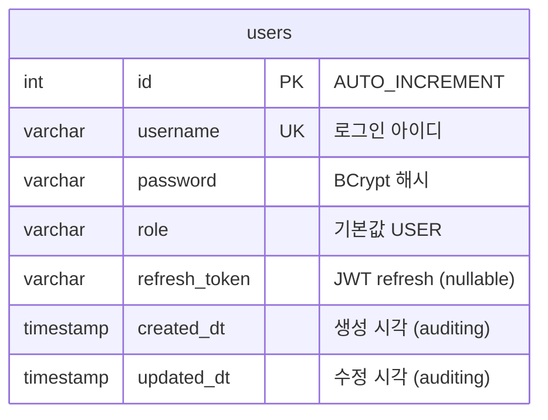

# DB ERD

`new-manager-server` 데이터베이스 스키마를 모듈 단위로 정리합니다.  
테이블·컬럼이 추가될 때마다 이 문서를 갱신합니다.

> 기준 DB: MariaDB `dcim_new` (test 프로파일)  
> 엔티티 위치: `module/{name}/domain/model`  
> 공통 컬럼: `shared/persistence/BaseEntity` (`created_dt`, `updated_dt`)

---

## 전체 관계도 (현재)



현재는 **단일 테이블**만 존재합니다. 다른 테이블이 생기면 위 다이어그램에 관계(FK)를 추가합니다.

---

## 테이블 상세

### `users` — 사용자 (identity 모듈)

| 컬럼 | 타입 | NULL | 키 | 설명 |
|------|------|------|-----|------|
| `id` | INT | N | PK | 사용자 ID |
| `username` | VARCHAR | N | UK* | 로그인 아이디 |
| `password` | VARCHAR | N | | BCrypt 인코딩 비밀번호 |
| `role` | VARCHAR | Y | | 권한 (`USER` 등) |
| `refresh_token` | VARCHAR | Y | | 리프레시 토큰 저장 |
| `created_dt` | TIMESTAMP | Y | | 최초 생성 시각 |
| `updated_dt` | TIMESTAMP | Y | | 최종 수정 시각 |

\* `username` UNIQUE: `sql/history/V001__create_users_table.sql` 기준 UK 적용. 엔티티에는 `@Column(unique = true)` 미선언.

**엔티티:** `module/identity/domain/model/User.java`  
**상속:** `BaseEntity` → `created_dt`, `updated_dt`  
**DDL 이력:** [sql/history/V001__create_users_table.sql](../sql/history/V001__create_users_table.sql)

**참고 (애플리케이션 규칙)**

- 신규 가입 시 `role` = `USER` (API 입력 없음, 코드에서 고정 — 아래 `role` 절 참고)
- `password`는 평문 저장하지 않음 (`PasswordEncoder` 사용)
- `refresh_token`은 로그인·토큰 갱신 시 갱신

### `role` (권한)

| 항목 | 내용 |
|------|------|
| API에서 입력? | **아니요** — `AuthRequest`는 `username`, `password`만 받음 |
| 어디서 설정? | `User.createNew()` 에서 `"USER"` 로 **하드코딩** |
| 종류 정의 위치 | **별도 enum/상수 없음** (현재 문자열 `"USER"` 만 사용) |
| Spring Security | `CustomUserDetails`가 `USER` → `ROLE_USER` 로 변환 |

```java
// User.createNew() — 회원가입 시 role 고정
return new User(username, encodedPassword, "USER", null);
```

나중에 `ADMIN` 등이 필요하면 `UserRole` enum 또는 `shared` 상수 클래스를 두는 방식을 권장합니다.

---

## 컬럼 ↔ 엔티티 매핑

| DB 컬럼 (snake_case) | Java 필드 | 출처 |
|----------------------|-----------|------|
| `id` | `id` | `User` |
| `username` | `username` | `User` |
| `password` | `password` | `User` |
| `role` | `role` | `User` |
| `refresh_token` | `refreshToken` | `User` |
| `created_dt` | `createdDt` | `BaseEntity` |
| `updated_dt` | `updatedDt` | `BaseEntity` |

Spring Boot 기본 naming strategy 기준으로 camelCase → snake_case 변환됩니다.

---

## 갱신 이력

| 날짜 | 변경 |
|------|------|
| 2026-06-26 | `users` 테이블 최초 등록 |
| 2026-06-26 | `sql/history/V001__create_users_table.sql` 추가 |
