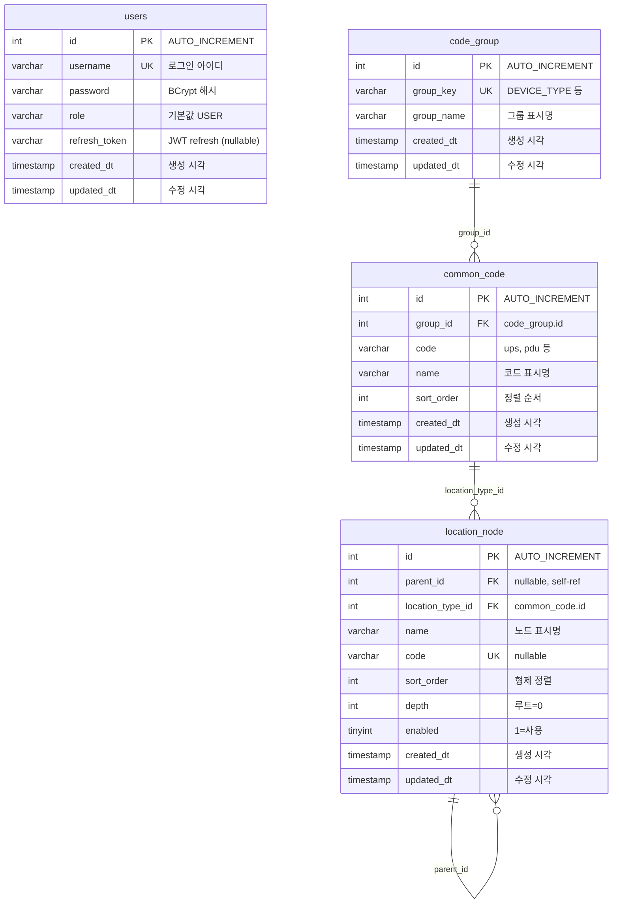

# DB ERD

`new-manager-server` 데이터베이스 스키마를 모듈 단위로 정리합니다.  
테이블·컬럼이 추가될 때마다 이 문서를 갱신합니다.

> 기준 DB: MariaDB `dcim_new` (test 프로파일)  
> 엔티티 위치: `module/{name}/domain/model`  
> 공통 컬럼: `shared/persistence/BaseEntity` (`created_dt`, `updated_dt`)

---

## 전체 관계도 (현재)



| 모듈 | 테이블 | 관계 |
|------|--------|------|
| identity | `users` | 독립 |
| common | `code_group` | 1 |
| common | `common_code` | N → `code_group` |
| location | `location_node` | N → `common_code` (LOCATION_TYPE), 자기참조 `parent_id`

---

## 테이블 상세

### `users` — 사용자 (identity 모듈)

| 컬럼 | 타입 | NULL | 키 | 설명 |
|------|------|------|-----|------|
| `id` | INT | N | PK | 사용자 ID |
| `username` | VARCHAR(255) | N | UK | 로그인 아이디 |
| `password` | VARCHAR(255) | N | | BCrypt 인코딩 비밀번호 |
| `role` | VARCHAR(50) | Y | | 권한 (`USER` 등) |
| `refresh_token` | VARCHAR(512) | Y | | 리프레시 토큰 저장 |
| `created_dt` | TIMESTAMP(6) | Y | | 최초 생성 시각 |
| `updated_dt` | TIMESTAMP(6) | Y | | 최종 수정 시각 |

**엔티티:** `module/identity/domain/model/User.java`  
**상속:** `BaseEntity`  
**DDL:** [V001__create_users_table.sql](../sql/history/V001__create_users_table.sql)

**참고 (애플리케이션 규칙)**

- 신규 가입 시 `role` = `USER` (API 입력 없음, `User.createNew()`에서 고정)
- `password`는 평문 저장하지 않음 (`PasswordEncoder` 사용)
- `refresh_token`은 로그인·토큰 갱신 시 갱신

#### `role` (권한)

| 항목 | 내용 |
|------|------|
| API에서 입력? | 아니요 — `AuthRequest`는 `username`, `password`만 |
| 어디서 설정? | `User.createNew()`에서 `"USER"` 하드코딩 |
| 종류 정의 | 별도 enum 없음 (현재 `"USER"`만) |
| Spring Security | `CustomUserDetails`가 `USER` → `ROLE_USER` 변환 |

---

### `code_group` — 코드 그룹 (common 모듈)

| 컬럼 | 타입 | NULL | 키 | 설명 |
|------|------|------|-----|------|
| `id` | INT | N | PK | 코드 그룹 ID |
| `group_key` | VARCHAR(100) | N | UK | 그룹 키 (예: `DEVICE_TYPE`) |
| `group_name` | VARCHAR(255) | N | | 그룹 표시명 |
| `created_dt` | TIMESTAMP(6) | Y | | 최초 생성 시각 |
| `updated_dt` | TIMESTAMP(6) | Y | | 최종 수정 시각 |

**엔티티:** `module/common/domain/model/CodeGroup.java`  
**상속:** `BaseEntity`  
**DDL:** [V002__create_code_group_table.sql](../sql/history/V002__create_code_group_table.sql)

**예시 데이터**

| id | group_key | group_name |
|----|-----------|------------|
| 1 | DEVICE_TYPE | Device Type |
| 2 | LOCATION_TYPE | Location Type |
| 3 | ASSET_TYPE | Asset Type |
| 4 | PROTOCOL_TYPE | Protocol Type |
| 5 | ALARM_TYPE | Alarm Type |

---

### `common_code` — 공통 코드 (common 모듈)

| 컬럼 | 타입 | NULL | 키 | 설명 |
|------|------|------|-----|------|
| `id` | INT | N | PK | 공통 코드 ID |
| `group_id` | INT | N | FK | `code_group.id` |
| `code` | VARCHAR(100) | N | UK* | 코드 값 (예: `ups`, `pdu`) |
| `name` | VARCHAR(255) | N | | 코드 표시명 |
| `sort_order` | INT | Y | | 목록 정렬 순서 |
| `created_dt` | TIMESTAMP(6) | Y | | 최초 생성 시각 |
| `updated_dt` | TIMESTAMP(6) | Y | | 최종 수정 시각 |

\* UK: `(group_id, code)` 복합 유니크 — 같은 그룹 내 코드 중복 불가

**엔티티:** `module/common/domain/model/CommonCode.java`  
**상속:** `BaseEntity`  
**연관:** `@ManyToOne` → `CodeGroup` (`@JoinColumn(name = "group_id")`)  
**DDL:** [V003__create_common_code_table.sql](../sql/history/V003__create_common_code_table.sql)

**FK 제약**

| FK | 참조 | ON DELETE | ON UPDATE |
|----|------|-----------|-----------|
| `fk_common_code_group_id` | `code_group(id)` | RESTRICT | CASCADE |

**예시 데이터**

| id | group_id | code | name | sort_order |
|----|----------|------|------|------------|
| 1 | 1 | ups | UPS | 1 |
| 2 | 1 | pdu | PDU | 2 |
| 3 | 1 | sensor | Sensor | 3 |
| 4 | 2 | rack | Rack | 1 |
| 5 | 2 | row | Row | 2 |
| 6 | 3 | rack | Rack | 1 |
| 7 | 4 | snmp | SNMP | 1 |

---

### `location_node` — 위치 트리 노드 (location 모듈)

| 컬럼 | 타입 | NULL | 키 | 설명 |
|------|------|------|-----|------|
| `id` | INT | N | PK | 위치 노드 ID |
| `parent_id` | INT | Y | FK | 부모 노드 ID. **루트는 NULL** |
| `location_type_id` | INT | N | FK | 위치 유형 (`common_code.id`, **LOCATION_TYPE만 허용**) |
| `name` | VARCHAR(255) | N | UK* | 노드 표시명 |
| `code` | VARCHAR(100) | Y | UK | 내부 식별 코드 (연동·API용) |
| `sort_order` | INT | Y | | 같은 부모 아래 형제 정렬 순서 |
| `depth` | INT | N | | 트리 깊이 (루트 = 0) |
| `enabled` | TINYINT(1) | N | | 사용 여부 (`1`=사용, `0`=비사용, 기본값 `1`) |
| `created_dt` | TIMESTAMP(6) | Y | | 최초 생성 시각 |
| `updated_dt` | TIMESTAMP(6) | Y | | 최종 수정 시각 |

\* UK: `(parent_id, name)` 복합 유니크 — 같은 부모 아래 이름 중복 불가

**엔티티:** `module/location/domain/model/LocationNode.java` (예정)  
**상속:** `BaseEntity`  
**연관:**
- `@ManyToOne` → `LocationNode` (`@JoinColumn(name = "parent_id")`) — 자기 참조
- `@ManyToOne` → `CommonCode` (`@JoinColumn(name = "location_type_id")`)

**DDL:** [V004__create_location_node_table.sql](../sql/history/V004__create_location_node_table.sql)

**FK 제약**

| FK | 참조 | ON DELETE | ON UPDATE |
|----|------|-----------|-----------|
| `fk_location_node_parent_id` | `location_node(id)` | RESTRICT | CASCADE |
| `fk_location_node_location_type_id` | `common_code(id)` | RESTRICT | CASCADE |

**트리 규칙 (애플리케이션)**

| 구분 | 조건 |
|------|------|
| 루트 노드 | `parent_id IS NULL` |
| 리프 노드 | `parent_id = 이 노드 id` 인 행이 없음 |
| 위치 유형 | `location_type_id` → `common_code` 중 `group_key = 'LOCATION_TYPE'`만 허용 (DB FK는 `common_code`만 검증) |
| 순환 참조 | 금지 (애플리케이션 검증) |
| 자식 있는 노드 삭제 | 정책 미정 (현재 FK `ON DELETE RESTRICT`) |

**예시 데이터**

`LOCATION_TYPE` common_code: `site`, `building`, `floor`, `row`, `rack` …

| id | parent_id | location_type_id | name | code | depth |
|----|-----------|------------------|------|------|-------|
| 1 | NULL | site | 본사 | site-hq | 0 |
| 2 | 1 | building | A동 | bld-a | 1 |
| 3 | 2 | floor | 1층 | floor-1 | 2 |
| 4 | 3 | row | In-Row-01 | row-01 | 3 |
| 5 | 4 | rack | Rack-01 | rack-01 | 4 |

---

## 컬럼 ↔ 엔티티 매핑

### identity — `User`

| DB 컬럼 | Java 필드 | 출처 |
|---------|-----------|------|
| `id` | `id` | `User` |
| `username` | `username` | `User` |
| `password` | `password` | `User` |
| `role` | `role` | `User` |
| `refresh_token` | `refreshToken` | `User` |
| `created_dt` | `createdDt` | `BaseEntity` |
| `updated_dt` | `updatedDt` | `BaseEntity` |

### common — `CodeGroup`

| DB 컬럼 | Java 필드 | 출처 |
|---------|-----------|------|
| `id` | `id` | `CodeGroup` |
| `group_key` | `groupKey` | `CodeGroup` |
| `group_name` | `groupName` | `CodeGroup` |
| `created_dt` | `createdDt` | `BaseEntity` |
| `updated_dt` | `updatedDt` | `BaseEntity` |

### common — `CommonCode`

| DB 컬럼 | Java 필드 | 출처 |
|---------|-----------|------|
| `id` | `id` | `CommonCode` |
| `group_id` | `codeGroup` | `CommonCode` (`@ManyToOne`) |
| `code` | `code` | `CommonCode` |
| `name` | `name` | `CommonCode` |
| `sort_order` | `sortOrder` | `CommonCode` |
| `created_dt` | `createdDt` | `BaseEntity` |
| `updated_dt` | `updatedDt` | `BaseEntity` |

### location — `LocationNode` (예정)

| DB 컬럼 | Java 필드 | 출처 |
|---------|-----------|------|
| `id` | `id` | `LocationNode` |
| `parent_id` | `parent` | `LocationNode` (`@ManyToOne`, self) |
| `location_type_id` | `locationType` | `LocationNode` (`@ManyToOne` → `CommonCode`) |
| `name` | `name` | `LocationNode` |
| `code` | `code` | `LocationNode` |
| `sort_order` | `sortOrder` | `LocationNode` |
| `depth` | `depth` | `LocationNode` |
| `enabled` | `enabled` | `LocationNode` |
| `created_dt` | `createdDt` | `BaseEntity` |
| `updated_dt` | `updatedDt` | `BaseEntity` |

Spring Boot 기본 naming strategy 기준으로 camelCase → snake_case 변환됩니다.

---

## DDL 적용 순서

```
V001 → users
V002 → code_group
V003 → common_code        (V002 선행)
V004 → location_node      (V003 선행)
```

---

## 갱신 이력

| 날짜 | 변경 |
|------|------|
| 2026-06-26 | `users` 테이블 최초 등록 |
| 2026-06-26 | `sql/history/V001__create_users_table.sql` 추가 |
| 2026-06-26 | `code_group`, `common_code` 테이블 및 ERD 관계 추가 |
| 2026-06-26 | `sql/history/V002`, `V003` 추가 |
| 2026-07-01 | `location_node` 테이블 및 ERD 추가 |
| 2026-07-01 | `sql/history/V004__create_location_node_table.sql` 추가 |
