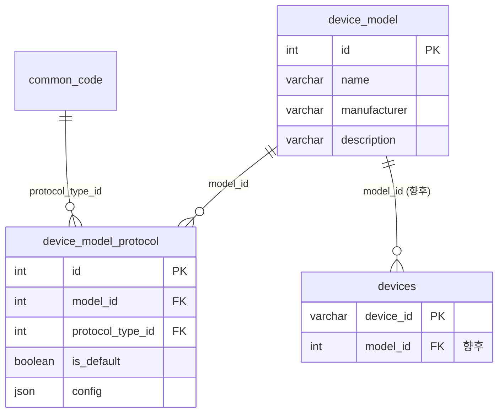

# DeviceModel API 설계

`devicemodel` 모듈의 **장비 제품 모델**(`device_model`) API·스키마·비즈니스 규칙을 정리한 문서입니다.

> 기존 `manager-server`의 `Model` 엔티티·`/api/manager/models` API를 기반으로, **프로토콜 1:N** 구조로 확장합니다.  
> API prefix: `/api/manager/device-models`  
> 패키지: `net.vivans.dcim.module.devicemodel`  
> 관련 ERD: [ERD.md — device_model (예정)](../ERD.md)  
> DDL (예정): `sql/history/V005__create_device_model_tables.sql`

---

## 1. 개요

### 1.1 목적

| 개념 | 설명 |
|------|------|
| **DeviceModel** | 제조사·제품명 등 **장비 SKU/제품군** 메타데이터. 여러 `devices` 인스턴스가 참조 |
| **DeviceModelProtocol** | 모델별 지원 **프로토콜 정의** (1개~N개). SNMP, Modbus, MQTT 등 |
| **Device** (향후) | 실제 설치된 장비 인스턴스. `model_id` FK로 모델 메타를 **참조** |

### 1.2 패키지·클래스 네이밍

| 구분 | 이름 |
|------|------|
| 모듈 패키지 | `module/devicemodel` |
| 엔티티 | `DeviceModel`, `DeviceModelProtocol` |
| 컨트롤러 | `DeviceModelController` |
| 테이블 | `device_model`, `device_model_protocol` |

> Java 패키지명은 소문자(`devicemodel`). 클래스·API는 `DeviceModel` / `device-models` 형태를 사용합니다.

### 1.3 기존 프로젝트와의 차이

| 항목 | 기존 `manager-server` | `new-manager-server` (본 설계) |
|------|----------------------|--------------------------------|
| 모듈·엔티티 | `Model` | `DeviceModel` (`devicemodel` 모듈) |
| API path | `/api/manager/models` | `/api/manager/device-models` |
| 프로토콜 | `Model.protocol` 단일 `enum` | `device_model_protocol` 테이블로 **1:N** |
| 프로토콜 타입 | `ProtocolType` enum | `common_code` (`PROTOCOL_TYPE` 그룹) |
| Device 연동 | `devices.model_id` → `Model` | 동일 개념 유지 (`device_model.id`) |
| 파일(이미지) | `Model.fileInfo` | **후속** — `file_info` 모듈 연동 시 FK 추가 |

### 1.4 Device와의 관계 (상속이 아닌 참조)

DB/JPA **테이블 상속이 아닙니다.** `devices`가 `model_id` FK로 `device_model`을 가리킵니다.

```
device_model (제품 정의: 제조사, 이름, 지원 프로토콜 목록)
      ↑
      │ model_id (FK)
      │
devices (인스턴스: device_id, location_node_code, IP, 개별 attributes …)
```

- Device는 모델의 **제조사·이름·프로토콜 후보** 등을 모델에서 가져와 사용
- Device만의 값(위치, 부모 장비, 수집 설정 등)은 `devices` 테이블에 보관
- 모델 삭제 시 Device가 참조 중이면 **삭제 불가** (기존과 동일)

---

## 2. 스키마 (안)

### 2.1 `device_model`

| 컬럼 | 타입 | NULL | 키 | 설명 |
|------|------|------|-----|------|
| `id` | INT | N | PK | AUTO_INCREMENT |
| `name` | VARCHAR(255) | N | UK* | 모델/제품명 (예: `LHT65N-PIR`) |
| `manufacturer` | VARCHAR(255) | Y | UK* | 제조사 (예: `Dragino`) |
| `description` | VARCHAR(1000) | Y | | 설명 |
| `device_type_id` | INT | Y | FK | 장비 유형 (`common_code`, `DEVICE_TYPE`) — **검토 중** |
| `created_dt` | TIMESTAMP(6) | Y | | 생성 시각 |
| `updated_dt` | TIMESTAMP(6) | Y | | 수정 시각 |

\* UK: `(name, manufacturer)` — 동일 제조사·제품명 중복 방지 (`manufacturer` NULL은 별도 처리 검토)

**엔티티:** `module/devicemodel/domain/model/DeviceModel.java`

### 2.2 `device_model_protocol`

| 컬럼 | 타입 | NULL | 키 | 설명 |
|------|------|------|-----|------|
| `id` | INT | N | PK | AUTO_INCREMENT |
| `model_id` | INT | N | FK | `device_model.id` |
| `protocol_type_id` | INT | N | FK | `common_code.id` (`PROTOCOL_TYPE`만 허용) |
| `is_default` | TINYINT(1) | N | | 기본 프로토콜 여부 (모델당 **최대 1개** true) |
| `config` | JSON | Y | | 프로토콜별 설정 (OID 맵, 포트 등 — **후속**) |
| `sort_order` | INT | Y | | UI·우선순위 정렬 |
| `created_dt` | TIMESTAMP(6) | Y | | |
| `updated_dt` | TIMESTAMP(6) | Y | | |

| 제약 | 규칙 |
|------|------|
| UK | `(model_id, protocol_type_id)` — 같은 모델에 동일 프로토콜 중복 불가 |
| FK | `model_id` → `device_model(id)` ON DELETE RESTRICT |
| FK | `protocol_type_id` → `common_code(id)` ON DELETE RESTRICT |

**엔티티:** `module/devicemodel/domain/model/DeviceModelProtocol.java`

### 2.3 `devices` (향후, 참고)

| 컬럼 | 설명 |
|------|------|
| `model_id` | `device_model.id` FK (nullable 여부 **검토**) |
| `protocol_type_id` | 모델이 프로토콜 N개일 때 Device가 **선택한** 프로토콜 — **검토 중** |

> 모델에 프로토콜이 1개뿐이면 Device는 별도 선택 없이 모델 기본값 사용 가능.

---

## 3. ER 다이어그램 (안)



---

## 4. API (안)

**구현 상태:** ⬜ 미구현 (스켈레톤: `DeviceModelController`)

### 4.1 목록 조회 — `GET /api/manager/device-models`

- 전체 모델 + `protocols[]` 중첩 반환

```json
{
  "status": 200,
  "data": [
    {
      "id": 1,
      "name": "LHT65N-PIR",
      "manufacturer": "Dragino",
      "description": "동작 감지 센서",
      "protocols": [
        {
          "id": 10,
          "protocolTypeId": 7,
          "protocolCode": "mqtt",
          "protocolName": "MQTT",
          "isDefault": true,
          "sortOrder": 1
        }
      ]
    }
  ]
}
```

### 4.2 등록 — `POST /api/manager/device-models`

```json
{
  "name": "LHT65N-PIR",
  "manufacturer": "Dragino",
  "description": "동작 감지 센서",
  "protocols": [
    { "protocolTypeId": 7, "isDefault": true, "sortOrder": 1 }
  ]
}
```

| 규칙 | 설명 |
|------|------|
| `protocols` | 1개 이상 필수 |
| `isDefault` | 정확히 1개 `true` (또는 1개만 있으면 자동 true) |
| `protocolTypeId` | `PROTOCOL_TYPE` 그룹만 허용 |

### 4.3 수정 — `PUT /api/manager/device-models/{id}`

- `name`, `manufacturer`, `description`, `protocols` 일괄 갱신 (전체 교체 방식 **안**)

### 4.4 삭제 — `DELETE /api/manager/device-models/{id}`

| 조건 | HTTP |
|------|------|
| 참조 중인 `devices` 없음 | 200 |
| Device 참조 중 | 409 또는 400 |
| 없는 ID | 404 |

---

## 5. 비즈니스 규칙

| 항목 | 규칙 |
|------|------|
| 프로토콜 개수 | 모델당 1~N |
| 기본 프로토콜 | `is_default=true`는 모델당 최대 1개 |
| 프로토콜 타입 | `common_code.group_key = 'PROTOCOL_TYPE'` |
| 모델 삭제 | `devices.model_id` 참조 시 불가 |
| Device 생성 (향후) | `model_id` 지정 시 모델 존재·프로토콜 유효성 검증 |

---

## 6. 선행 조건

| 항목 | 상태 |
|------|------|
| `code_group` / `common_code` | ✅ |
| `PROTOCOL_TYPE` 시드 데이터 | ⬜ 필요 (snmp, modbus, mqtt …) |
| `file_info` (모델 이미지) | ⬜ 후속 — V1에서는 생략 가능 |
| `devices` 테이블 | ⬜ devicemodel 개발 후 |

---

## 7. 구현 순서 (제안)

1. `PROTOCOL_TYPE` common_code 시드
2. `V005` DDL — `device_model`, `device_model_protocol`
3. DeviceModel CRUD API + protocols 동시 등록/수정
4. 단위·통합 테스트
5. (후속) `devices` + `model_id` FK

---

## 8. 미확정 사항

| 항목 | 질문 |
|------|------|
| `device_type_id` on model | 모델에 장비 유형을 고정할지 |
| Device의 프로토콜 선택 | `devices.protocol_type_id` 컬럼 필요 여부 |
| `config` JSON 스키마 | 프로토콜별 설정 구조 (collector 연동 시 정의) |
| UK `(name, manufacturer)` | manufacturer NULL 허용 시 UK 처리 |

---

## 9. 갱신 이력

| 날짜 | 변경 |
|------|------|
| 2026-07-03 | 최초 작성 (설계안) |
| 2026-07-03 | 모듈·패키지명 `devicemodel`, 클래스 `DeviceModel` 확정. API `/device-models` 확정 |
